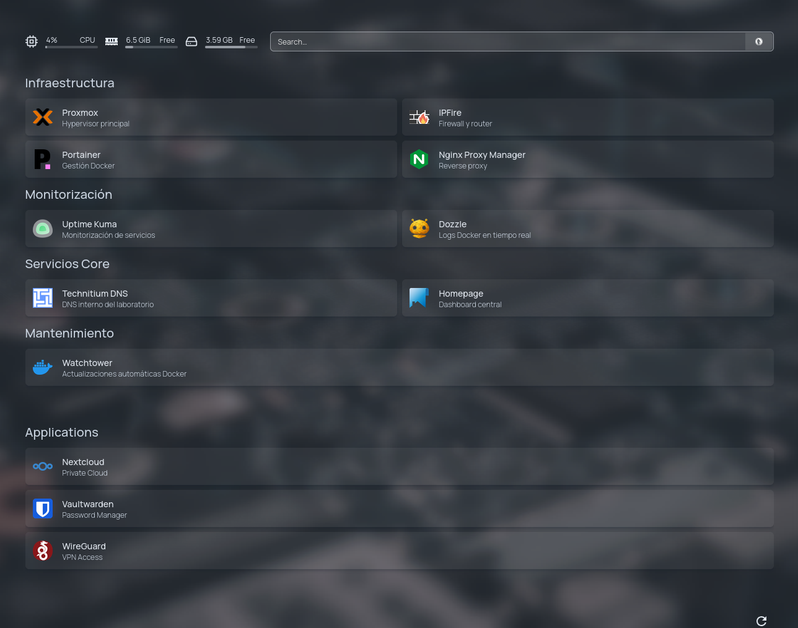
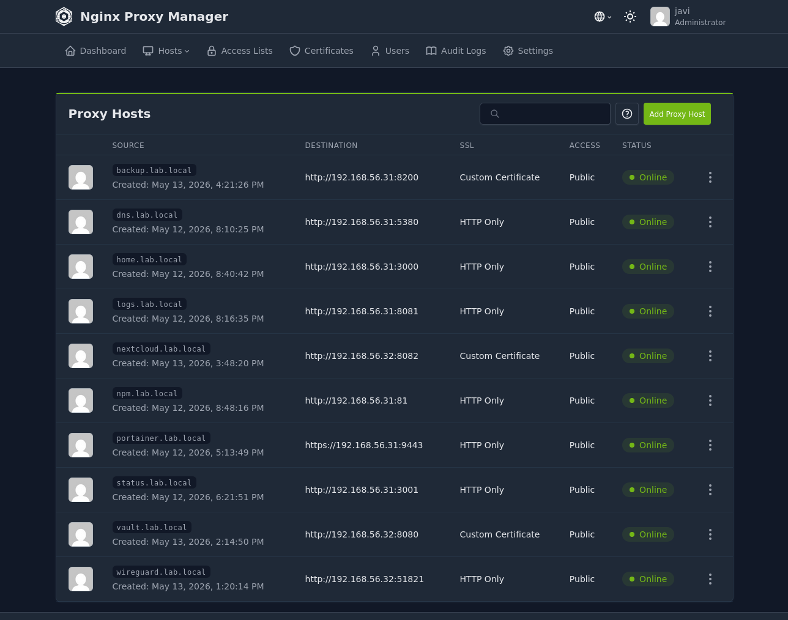
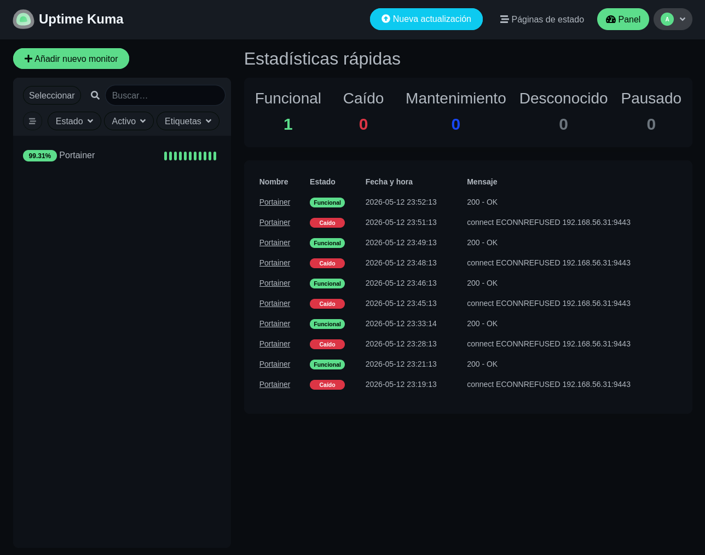
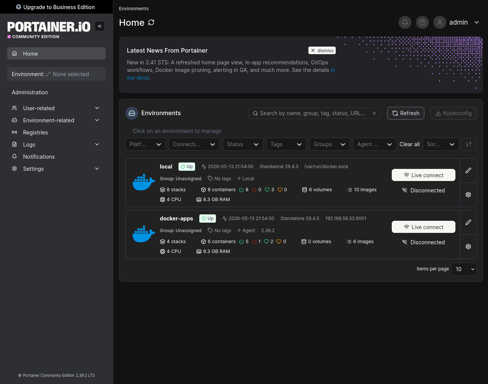
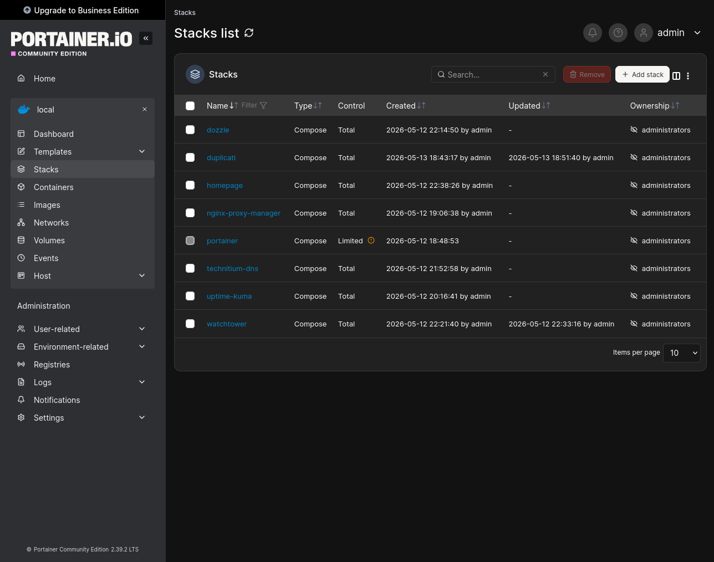
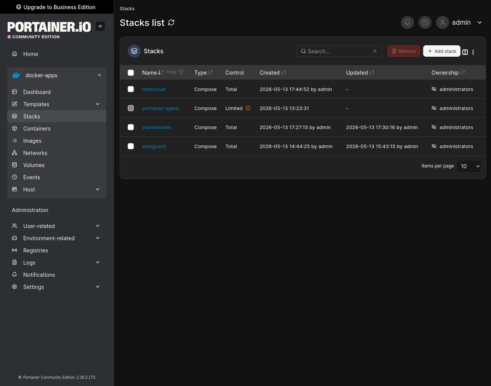

# MSP Docker Infrastructure Lab

Self-hosted MSP / DevOps infrastructure built with Docker, Proxmox and Linux.

---

# Overview

This project is a modular self-hosted infrastructure focused on:

- SysAdmin
- DevOps
- MSP environments
- Docker infrastructure
- Self-hosted business services
- Infrastructure as Code mentality
- Backup and disaster recovery
- Reusable deployments

---

# Infrastructure

## Hypervisor

- Proxmox VE

## Firewall

- IPFire

## Internal DNS

- Technitium DNS

## Reverse Proxy

- Nginx Proxy Manager

---

# Architecture

Client
↓
Technitium DNS
↓
Nginx Proxy Manager
↓
Docker Services

---

# Docker Hosts

## srv-docker-main

Core infrastructure services:

- Portainer
- Nginx Proxy Manager
- Technitium DNS
- Homepage
- Uptime Kuma
- Dozzle
- Watchtower
- Duplicati

---

## srv-docker-apps

Application services:

- WireGuard
- Vaultwarden
- Nextcloud
- Portainer Agent

---

# Features

- Docker multi-host infrastructure
- Reverse proxy architecture
- Internal DNS resolution
- Wildcard SSL certificates
- VPN remote access
- Password manager
- Private cloud
- Monitoring and logging
- Automated container updates
- Incremental backups
- Disaster recovery ready
- Persistent Docker volumes
- Infrastructure modularization

---

# Networks

- proxy_net
- backend_net
- monitoring_net

---

# Backup Strategy

Duplicati is used for:

- Incremental backups
- AES-256 encryption
- Deduplication
- Smart retention
- Disaster recovery preparation

---

# Technologies Used

- Linux
- Docker
- Docker Compose
- Proxmox
- IPFire
- WireGuard
- MariaDB
- Nginx
- Technitium DNS
- Git
- GitHub

---

# Future Roadmap

## Infrastructure

- Backup VM
- Grafana
- Prometheus
- SIEM
- Centralized logging
- Ansible
- CI/CD
- MinIO / S3 storage

## Applications

- Gitea
- Authentik
- Jellyfin
- Advanced monitoring

---

# Philosophy

Containers are disposable.

The important parts are:

- /opt/stacks
- /opt/data

Infrastructure should be:

- reusable
- modular
- documented
- reproducible

---

# Status

Project currently under active development.

---

# Screenshots

## Homepage Dashboard

---

## Nginx Proxy Manager

---

## Uptime Kuma

---

## Portainer Local

---

## Portainer Stacks

---

## Portainer Remote Apps Host

---

## Nextcloud

---

## Vaultwarden

---

## WireGuard

